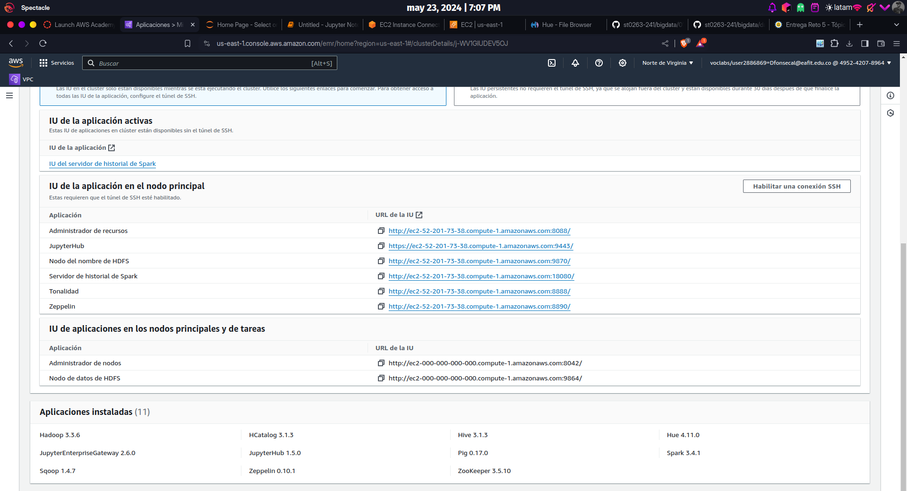

# Reto5
# ST0256 Tópicos Especiales en Telemática

## Estudiante:
- Nombre: David Fonseca Lara
- Correo: dfonsecal@eafit.edu.co

## Profesor:
- Nombre: Álvaro Ospina
- Correo: aeospinas@eafit.edu.co

# Reto 5 - HDFS y S3

## Cluster de Amazon EMR
Este es el cluster de Amazon EMR que se utilizó para el desarrollo del reto 5. El cluster fue creado con las indicaciones del
[Lab 0](https://github.com/st0263eafit/st0263-241/blob/main/bigdata/00-lab-aws-emr/Install-AWS-EMR.pdf):

## Gestión de archivos en HDFS y S3
1. Primero creé el bucket 

2. Despues creé y configuré el Cluster

3. Foto de las aplicaciones en el Cluster

4. Foto de las instancias

5. Foto en el Home de Jupyter

6. Subí 2 archivos al HDFS

7. Subí 2 archivos al S3

8. Por último subí todo el dataset al S3

